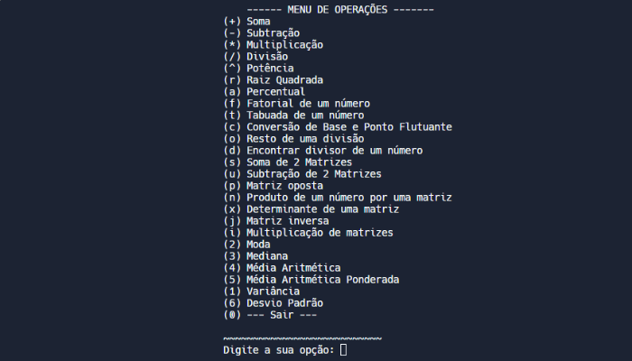

  <h1>Multifunctional Calculator</h1> 
   
  

 <h2>:bulb: About</h2>
The idea for the <strong>Multifunctional Calculator</strong> came up during math classes, as I wanted to create a tool that facilitated certain calculations to help solve unanswered questions during my studies.  
During the project's development I chose the <strong>C language</strong>, as I was still in my first period and it was the first programming language I learned. Later I changed the project and used <strong>TAD</strong>, inspired by my Data Structure classes and focused on organizing and simplifying the code.

  

 <h2>:test_tube: Link</h2>

 - [Clique para testar o projeto](https://replit.com/@KarenKnup/Calculadora-Multifuncional) **[PORTUGUÊS]**

 - [Click to test the project](https://replit.com/@KarenKnup/Multifunctional-Calculator) **[ENGLISH]**
 

<h2>:gear: Files</h2>

**`main.c :`** Main function  
**`calculadora.h :`** This is where the prototypes of the functions are, where the user calls the functions as in any library, that is, he uses the functions but does not need to know the process   
**`calculadora.c :`** This is where the "calculator.h" functions are developed

 

 <h2>:pencil: Functionalities</h2>
 
 Option | Functionality 
---- | --------- 
**`+`** | Sum of sequence numbers
**`-`** | Subtracting a sequence of numbers
**`*`** | Multiplication of a sequence of numbers
**`/`** | Division of a sequence of numbers
**`^`** | Power of a number
**`r`** | Square root of a number
**`a`** | x 
**`t`** | x 
**`o`** | x 
**`d`** | x 
**`s`** | x 
**`p`** | x 
**`u`** | x 
**`n`** | x 
**`i`** | x 
**`x`** | x 
**`j`** | x 
**`f`** | x 
**`q`** | x 
**`4`** | x 
**`5`** | x 
**`2`** | x 
**`3`** | x 
**`1`** | x 
**`6`** | x 
**`c`** | x 

